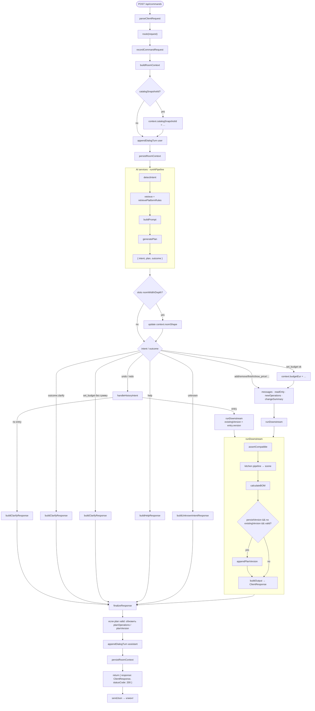

# Orchestrator flow

Source of truth: `apps/server/src/core/orchestrator.js` + `ai-services/pipeline.js`.

Open this file in any Mermaid preview (VS Code / Cursor Mermaid extension, GitHub, [mermaid.live](https://mermaid.live)).

