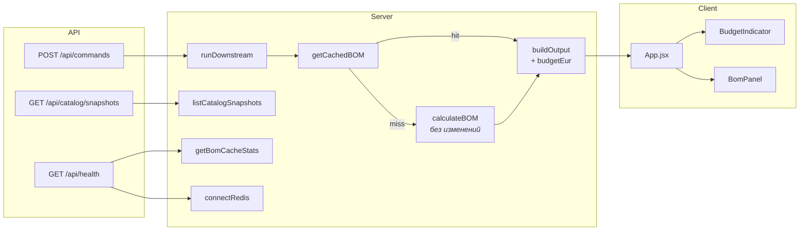

# Phase 3 — что добавили и куда смотреть

Pricing & BOM: снапшоты каталога, кэш BOM, смета и бюджет в UI.

---

## Карта потока (главное)



---

## Новое — по слоям

### 1. Redis (опционально)

📁 `apps/server/src/storage/redis.js`

| | Функция | Зачем |
|---:|---------|--------|
| 🟢 | `connectRedis()` | Подключение; `null` если нет `REDIS_URL` / ошибка |
| 🟢 | `getRedisClient()` | То же, что `connectRedis` |
| 🟢 | `closeRedis()` | Закрыть клиент |
| 🟢 | `redisConfigured()` | Есть ли `REDIS_URL` |

---

### 2. Кэш BOM

📁 `apps/server/src/pricing-engine/bom-cache.js`

```
getCachedBOM(plan, snapshotId)
        │
        ├─ memory HIT  ──► return BOM
        ├─ Redis HIT   ──► memory + return BOM
        └─ MISS        ──► calculateBOM() → write cache → return
```

| | Функция | Зачем |
|---:|---------|--------|
| 🟢 | `buildBomCacheKey(plan, catalogSnapshotId)` | Ключ `bom:v1:{snapshot}:{hash}` |
| 🟢 | `getCachedBOM(plan, catalogSnapshotId)` | Обёртка: memory + Redis → `calculateBOM` |
| 🟢 | `getBomCacheStats()` | hits / misses / hitRate / … |
| 🟢 | `resetBomCacheForTests()` | Сброс для тестов |

🧪 Тесты: `apps/server/src/pricing-engine/bom-cache.test.js`

⚠️ `calculateBOM` **не трогали** — остаётся чистым калькулятором  
📁 `apps/server/src/pricing-engine/calculateBOM.js`

---

### 3. Снапшоты каталога

📁 `apps/server/src/knowledge-base/catalog-store.js`

| | Функция | Зачем |
|---:|---------|--------|
| 🟢 | `listCatalogSnapshots()` | Список frozen snapshots |

Уже было (без изменений): `loadDemoCatalog`, `getCatalogSnapshot`, `DEFAULT_CATALOG_SNAPSHOT_ID`

---

### 4. Клиентский HUD

| | Компонент | Файл | Что показывает |
|---:|-----------|------|----------------|
| 🟢 | `BomPanel` | `apps/client/src/components/BomPanel.jsx` | Строки сметы + totals |
| 🟢 | `BudgetIndicator` | `apps/client/src/components/BudgetIndicator.jsx` | Прогресс бюджета / over |

Оба рендерятся слева в `App.jsx` под `RoomBadge`.

---

## Изменено — call sites

```text
orchestrator.js          runDownstream
        │
        ├─ getCachedBOM(...)     ← было calculateBOM
        └─ buildOutput({
               bom,
               budgetEur,        ← НОВОЕ
               ...
           })

output-builder.js        buildOutput
        └─ budgetEur в ClientResponse

client-response.js       ClientResponseSchema
        └─ budgetEur?: number | null

runtime.js               runtimeConfig
        └─ redisUrl, redisTimeoutMs, bomCacheTtlSec

routes.js                mountRoutes
        ├─ GET /api/health      → redis + bomCache
        └─ GET /api/catalog/snapshots  ← НОВЫЙ

App.jsx
        ├─ state: bom, budgetEur
        ├─ sync из postCommand result
        └─ <BudgetIndicator /> <BomPanel />
```

---

## API endpoints

| Method | Path | Что отдаёт |
|--------|------|------------|
| `POST` | `/api/commands` | как раньше + `budgetEur` в теле |
| `GET` | `/api/catalog/snapshots` | `{ snapshots: [...] }` |
| `GET` | `/api/health` | + `redis`, + `bomCache` stats |

---

## Конфиг и доки

| Файл | Что |
|------|-----|
| `.env.example` | `REDIS_URL`, `REDIS_TIMEOUT_MS`, `BOM_CACHE_TTL_SEC` |
| `apps/server/package.json` | dep `redis` + тест `bom-cache.test.js` |
| `docs/Roadmap.md` | чеклист 3.1–3.7 |
| `docs/PROJECT_PASSPORT.md` | статус Phase 3 |

---

## Легенда

- 🟢 новое  
- вызов/поле изменено — см. блок «Изменено»  
- без изменений — `calculateBOM`, логика `set_budget` на сервере  
